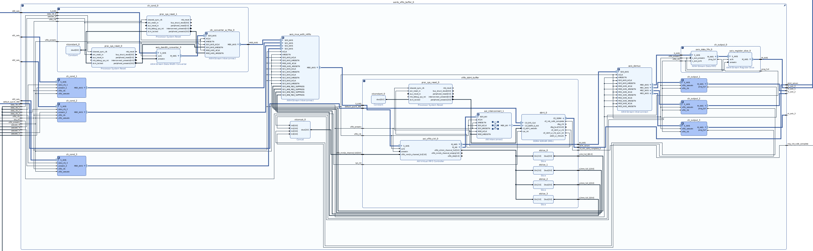

# axi4s_vfifo_buffer
This component provides a MIG (Memory interface Generator) based (external DDR memory) fifo buffering scheme (virtual fifo) for high bandwidth, multi channel, async, axi4 streams. It is platform dependent due to the nature of MIG. The objective of this component is to optimize the overall input to output throughput while providing large buffers in between. This is particularly useful as an elastic buffer for axi streams that cannot take back-pressure. **In addition to the `tdest` requirement mentioned below, keep in mind that the instances created based on this reference must be tuned for design specifics.**

## Implementation details

**This component is a simple IPI hierarchy** which integrates multiple axi stream IP components from the [axi stream infrastructure](../../../../../docs/xilinx/axi4_stream/pg085-axi4stream-infrastructure.pdf) together. The components are tied to a [xilinx' virtual fifo IP](../../../../../docs/xilinx/axi_vfifo_controller/pg038_axi_vfifo_ctrl.pdf) and provide arbitration, per channel input & output fifo buffers, and clock and data width converters.

## Limitations
The arbitration scheme on the input side of the virtual fifo IP does not take into account the fifo levels of the fifos in the channel conditioners and how quickly do those fifos fill up (data input rate).

### Channel conditioning
Each channel conditioner includes a combination of:
1. Clock and data width conversion for allowing flexible async axi streams
2. Packet fifos (data is available on the fifo's output interface only after `tlast` was received on the fifo's input interface). Packet fifos are critical for per channel reset (by flushing data through the output interface) since the virtual fifo IP only has a single global reset.

### Xilinx virtual fifo IP
The general scheme of the axi stream components used with the virtual fifo IP is depicted [here](../../../../../docs/xilinx/axi_vfifo_controller/pg038_axi_vfifo_ctrl.pdf#page=8). There are [several key points](../../../../../docs/xilinx/axi_vfifo_controller/pg038_axi_vfifo_ctrl.pdf#page=29) to pay attention to when designing with the virtual fifo IP:
1. Per channel page allocation and burst size, which are also correlated with packet size and should be configured carefully keeping the output interface requirements in mind
2. Per channel weight allocation for arbitration
3. Size of output buffers

### Mux/Demux of multiple axi4 stream channels
The virtual fifo IP has a single axi stream interface. It implements multi channel buffering based on the axi stream `tdest` signal. As a result, an arbitration scheme must be used to grant channel access. On the output side, a demux uses `tdest` to distribute the axi streams to different output fifos.\
**:information_source:The input axi streams must fill in `tdest` such that channel `i` uses `tdest` of `i`. This is critical for the arbitration scheme to work correctly**

### Output fifos
The output buffer size should be determined by the AR weight allocation and burst size as described [here](#xilinx-virtual-fifo-ip)

### Global reset and channel flushing
This component should be reset before initial use by toggling `ext_reset_in` which is active low (note that **[resets should only be applied when clocks are stable](https://support.xilinx.com/s/question/0D52E00006hpgGfSAI/builtin-fifo-reset?language=en_US)**).\
Individual channels cannot be reset, however, they can be flushed using a scheme such as the one described below. Note that this scheme does not guarantee a complete flush of a given channel since residual data can still remain in the channel conditioners.
1. Stop the input stream. This can be done using a custom axi4 stream component
2. Flush the channel by asserting `m_tready` of the output interface until it is empty.
3. Wait long enough for the channel `vfifo_clk` domain side buffers to completely empty out. Depending on factors such as packet size and output fifo size, the data on the output interface might come out back-to-back and then tvalid could be used to indicate when the channel is empty. Otherwise, this phase must be based on a waited timeout.
4. Stall the channel by deasserting `m_tready` of the output interface
5. Restart the input stream

### Using MIG with other AXI masters
The IPI hierarchy generated by this component includes a MIG for simple integration. If MIG is already used in the design, it can be easily pulled out of the hierarchy. An arbiter can then be placed in front of MIG, which will arbitrate between the AXI data stream sourced by the virtual fifo IP and other AXI masters.
